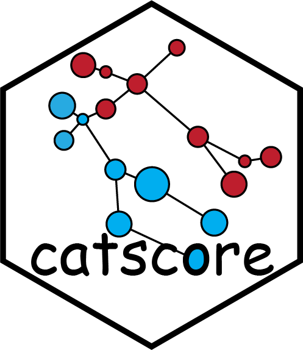

<!-- README.md is generated from README.Rmd. Please edit that file -->

```{r, include = FALSE}
knitr::opts_chunk$set(
  collapse = TRUE,
  comment = "#>",
  fig.path = "man/figures/README-",
  out.width = "100%"
)
```

# catscore: Capable And Tity Score 

<!-- badges: start -->

<!-- badges: end -->

## 🤪 Overview

`catscore` is a capable and tity pathway activity scores (PASs) analysis tool and maintained by [Songqi Duan](https://songqi.online).

## 📦 Installation

The R implementation of `catscore` is based on four R packages:

- [AUCell](https://github.com/aertslab/AUCell): score single cells with gene regulatory networks
- [UCell](https://github.com/carmonalab/UCell): an R package for single-cell gene signature scoring
- [VISION](https://github.com/YosefLab/VISION): signature analysis and visualization for single-cell RNA-seq
- [GSVA](https://github.com/rcastelo/GSVA): gene set variation analysis for microarray and RNA-seq data

```{r, eval = FALSE}
# To install this package, start R (version "4.0") and enter:
if (!requireNamespace("BiocManager", quietly = TRUE)) install.packages("BiocManager")

BiocManager::install("AUCell")
BiocManager::install("UCell")
BiocManager::install("GSVA")

if (!require(devtools)) install.packages("devtools")
devtools::install_github("YosefLab/VISION")
```

You are now ready to install the latest version from [GitHub](https://github.com/zerostwo/catscore) as follow:

```{r, eval = FALSE}
if (!require(devtools)) install.packages("devtools")
devtools::install_github("zerostwo/catscore")
```

## 🕹️ Usage

```{r, eval = FALSE}
library(catscore)

data("pbmc_small")

# 1. Pathway activity scores (PASs)
pbmc_small <- pbmc_small |>
  cat_score(
    gene_sets = "CP:KEGG",
    method = "GSVA"
  )

# 2. Differential analysis
diff_pathway <- pbmc_small |>
  compare_pathways(
    control = "g1",
    treatment = "g2",
    group_by = "groups"
  )
```
